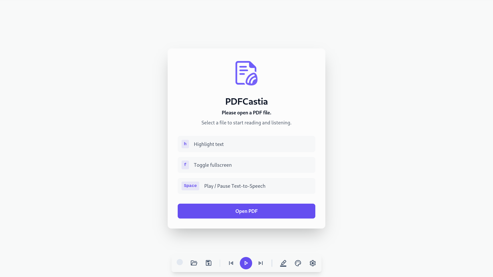
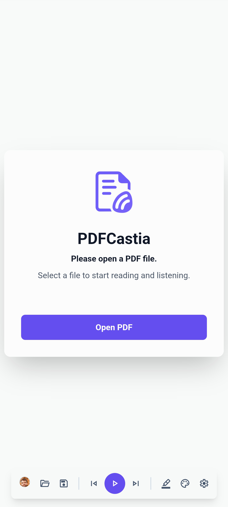

# PDF Sentence Highlighter + Piper TTS

A modern, **progressive web app (PWA)** for reading and listening to PDFs in your browser.  
Highlights sentences in PDF documents, enables navigation by sentence or page, and uses local [Piper TTS](https://github.com/rhasspy/piper) for fast, private audio playback.  
Works offline, remembers your position in each PDF, and is optimized for desktop and mobile.

---

## Features

- **PDF Sentence Highlighting:** See which sentence is being read aloud.
- **Local TTS (Piper):** All text-to-speech runs in your browser, no data leaves your device.
- **Multi-PDF Resume:** Remembers your progress for each PDF (even local files).
- **Full Document Mode:** Render the whole PDF at once for context, or just the current page.
- **Modern Toolbar:** Font Awesome icons, responsive controls.
- **Prefetch & Fast Audio:** Sentences are pre-generated for smooth playback.
- **Offline Capable:** Install as a PWA and use offline.
- **Mobile Friendly:** UI adapts for touch and small screens.
- **Drag & Drop:** Open PDFs by dropping files onto the app.
- **Dark/Light Theme:** Follows your system preference.

---
## Usage

- **Install as App:**  
  On Chrome/Edge/Safari, click the install icon in the address bar, or use browser menu to "Add to Home Screen."
- **Mobile:**  
  App auto-adjusts layout, buttons are larger, PDF pages scale to fit.  
  You can scroll, tap, and listen just as on desktop.
- **Resume Anywhere:**  
  Your position in each PDF (by file name & size) is remembered automatically.

---

## PWA / Offline

- The app uses a service worker to cache:
  - The shell (HTML, CSS, JS, icons)
  - PDF.js and Piper TTS libraries
  - Recently accessed PDFs
- If offline, you can still listen to cached PDFs and use TTS features.

---

## Tech Stack

- **JavaScript (ES6 modules)**
- **PDF.js** - Parsing and rendering PDFs
- **Piper TTS (WebAssembly)** - Fast, local text-to-speech
- **Font Awesome** - Icons
- **Service Worker / Manifest** - For PWA features

---

## Contributing

Pull requests and issues welcome!  
Please open issues for bugs, feature requests, or suggestions for mobile improvements.

---

## Credits

- [PDF.js](https://github.com/mozilla/pdf.js)
- [Piper TTS](https://github.com/rhasspy/piper)
- [Font Awesome](https://fontawesome.com/)

---

## Screenshots

    

    

---

## TODO / Roadmap

- [ ] Virtualized rendering for very large PDFs
